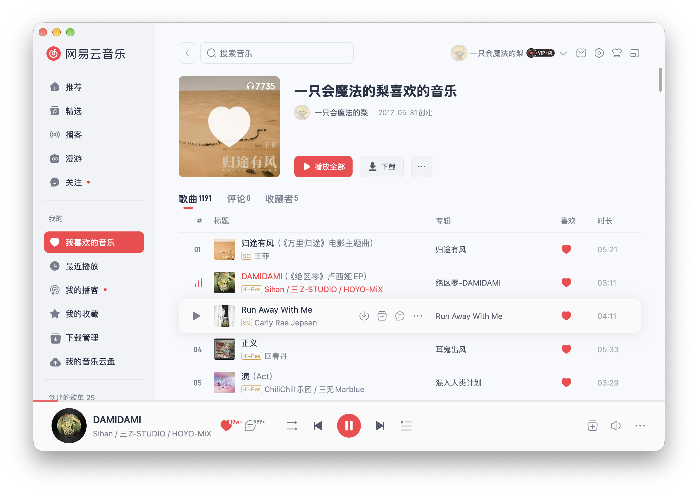

# netease-music-gpui

使用 Rust 和 [GPUI](https://gpui.rs/) 复刻网易云音乐桌面界面的练手项目，逐步接入真实账号、歌单和歌曲播放，学习原生 UI、共享状态与异步音频处理。

项目仍在开发中，主要在 macOS 上开发和验证，其他平台尚未验证。



> [!TIP]
> 是的，你没有看错！这不是原版而是 GPUI 原生实现！！


## 当前功能

- 通过网易云登录 COOKIE 获取账号资料、头像和会员信息。
- 加载个人歌单与「我喜欢的音乐」，展示真实歌曲、封面、创建者和喜欢状态。
- 虚拟化歌曲列表，支持排序和拖动标题／专辑列分界线。
- 歌单列表的音质徽章取 `song_detail` 的 `privileges.playMaxBrLevel`，标出平台为这首歌提供的最高档位（含超清母带、臻音、沉浸声、全景声）；该字段不随登录态变化，实际能否播放仍取决于账号权限。
- 选歌、播放全部、暂停／继续、上一首／下一首，以及播完自动播放下一首。
- HTTP Range 分段缓存和后台解码，拖动后优先下载目标区间；切换页面不会停止播放。
- 播放控制接口支持接口提供的全部九档音质：标准、较高、极高、无损、Hi-Res、高清臻音、沉浸声、全景声、超清母带；音质菜单暂未接入当前播放栏。
- 播放栏恢复原有 SVG 图标；播放失败后点击播放可重试。
- 播放栏展示歌曲信息、红心计数和评论计数。

## 运行

需要较新的 Rust stable 工具链、Git、网络连接及可用的网易云登录 COOKIE。macOS 编译环境还需要 Xcode Command Line Tools。

在项目根目录运行：

```bash
export COOKIE='你的网易云登录 Cookie'
cargo run --locked
```

`COOKIE` 应填写登录后请求中的 Cookie 字符串，不包含 `Cookie:` 请求头名称。应用启动时直接读取环境变量，缺失或为空会退出；播放权限取决于账号及接口返回的资源。

应用不会自动加载 `.env`。如果已经安装支持 `dotenv run` 的工具，可以在根目录的 `.env` 中配置：

```dotenv
COOKIE=你的网易云登录 Cookie
```

然后运行：

```bash
dotenv run cargo run --locked
```

`.env` 已加入 `.gitignore`。Cookie 属于登录凭据，请勿提交到仓库。

## 打包

在 macOS 或 Windows 上安装 Python 3.9+，运行以下命令构建当前平台的 release 并复制资源（Windows 也可以使用 `py -3`）：

```bash
python3 scripts/package.py
```

macOS 生成 `target/bundle/NetEase Music.app`，可执行文件位于 `Contents/MacOS`，图标、图片和字体位于 `Contents/Resources/assets`；Windows 生成 `target/bundle/netease-music-gpui/`，里面包含 `.exe` 和 `assets/`。如果配置了自定义 Cargo target 目录，产物位于该目录的 `bundle/`。请分发完整应用包或目录，不要只复制可执行文件。脚本只构建本机平台，不负责交叉编译、制作安装程序或收集额外的 Windows 运行库。

所有项目资源都从外部目录读取。单独执行 `cargo build --release` 不会复制资源，应使用上述脚本生成可分发目录。

macOS 包使用本地 ad-hoc 签名，没有 Developer ID 签名和公证。当前应用仍要求 `COOKIE` 环境变量，Finder 双击通常不会继承终端里设置的变量；现阶段可以从终端运行：

```bash
COOKIE='你的网易云登录 Cookie' 'target/bundle/NetEase Music.app/Contents/MacOS/netease-music-gpui'
```

验证打包目录结构：

```bash
python3 scripts/test_package.py
```

## 技术栈

| 依赖 | 用途 |
| --- | --- |
| GPUI / gpui-kit | 原生窗口、布局、组件与 Entity 状态管理 |
| ncm-api-rs | 网易云账号、歌单、歌曲详情和播放地址接口 |
| Tokio / reqwest | 异步网络请求与音频下载 |
| CPAL | 音频设备与直接 PCM 输出 |
| Symphonia | 音频格式解析、跳转和可报告错误的后台解码 |
| serde / serde_json | API 数据解析 |

音频下载直接使用标准 `reqwest`；GPUI 图片请求使用 `reqwest-client` 适配器。适配器内部依赖 `gpui-pre-reqwest` 分支，因此两者各自复用客户端和连接池。

## 目录结构

```text
src/
├── main.rs                  初始化与应用组装
├── api.rs                   网易云接口、网络客户端与 Tokio 运行时
├── models/                  歌曲、歌单、用户及播放资源的数据模型
├── state/                   账号、音乐库和歌单详情的共享状态
├── playback/
│   ├── controller.rs        统一播放接口、队列和 GPUI 状态通知
│   ├── engine.rs            音频设备、播放源、暂停和音量
│   ├── stream.rs            音源组装、跳转和取消生命周期
│   └── stream/
│       ├── download.rs      HTTP Range 下载和字节缓存
│       ├── decode.rs        Symphonia 解析、定位和解码
│       ├── output.rs        PCM 队列、采样率与声道转换
│       └── tests.rs         本地 HTTP 与音频回归测试
└── ui/
    ├── shell.rs             主窗口布局和导航协调
    ├── sidebar.rs           侧栏
    ├── pages/               页面
    ├── components/          播放栏、进度条、标签栏和虚拟表格
    ├── assets.rs            资源加载与缩略图地址
    └── theme.rs             字体与主题

assets/                      图标、图片和字体
docs/architecture.md         模块职责与播放链路说明
```

共享业务状态由 GPUI Entity 管理，View 观察通知并渲染。界面通过 `PlaybackController` 提交播放命令，通过只读 `snapshot()` 获取状态；底层音频引擎不依赖 GPUI。

详细设计见 [架构文档](docs/architecture.md)。

## 开发验证

```bash
cargo fmt --check
cargo check --locked --all-targets
cargo test --locked
```

普通测试不启动界面，也不需要外网或声卡；播放回归测试使用本地 HTTP 服务器、内存生成的 WAV 和仓库内的 MP3、AAC/M4A、96 kHz FLAC 测试音频，覆盖 Range 跳转、取消、失败恢复和损坏数据。音频来源及生成方式见 [测试音频说明](tests/fixtures/README.md)。真实接口测试默认忽略，配置 COOKIE 后可以单独运行：

```bash
cargo test --locked cookie_can_load_real_library -- --ignored
```

## 当前限制

- 高音质取决于账号权限和歌曲资源；接口可能返回较低音质、试听片段，或因权限和下架状态无法播放。
- Range 缓存上限为 32 MiB，尚未实现持久磁盘缓存。服务器不支持 Range 时回退到顺序下载，缓存上限为 256 MiB，未下载位置仍需要等待。
- MP3 为避免从头扫描采用 Coarse 跳转，VBR 文件的定位可能近似。
- 队列按选歌时的列表顺序播放，末尾停止；尚未实现随机播放、循环模式和队列管理界面。
- 音量控制接口已实现，音量调整 UI 尚未接入。
- 搜索、下载、分享等功能以及部分页面仍是占位；评论和收藏者标签尚未实现内容加载。
