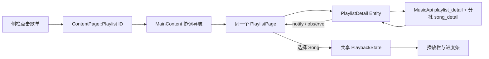

# 项目结构与歌单链路

## 运行和验证

应用通过 `std::env::var("COOKIE")` 读取登录凭据，不自行读取 `.env`。
开发时可使用 `dotenv run cargo run`；普通检查使用 `cargo check`、`cargo test`，真实接口验证使用 `dotenv run cargo test -- --include-ignored`。

## 状态、页面和元素的职责

按 `AGENTS.md` 的 GPUI 分层方式组织：共享数据放在 Entity，页面实现 Render，布局和绘制使用 Element。

| 位置 | 职责 |
| --- | --- |
| `src/api.rs` | 共享 SDK 客户端和 Tokio 运行时；超时、响应检查、账号/歌单/歌曲接口。 |
| `src/state/user.rs` | 登录账号资料；只供账号相关界面使用，不能代替歌单创建者。 |
| `src/state/library.rs` | 账号的歌单索引和喜欢的歌曲 ID；不持有某个歌单的歌曲。 |
| `src/state/playlist.rs`、`song.rs` | 与 API 字段对应的业务数据模型。 |
| `src/state/playlist_detail.rs` | 当前歌单详情、歌曲、加载与错误状态，以及请求取消和过期结果校验。 |
| `src/state/playback.rs` | 当前歌曲、播放队列、音频输出和进度；统一管理加载、切歌、暂停、seek 和顺序播放。 |
| `src/pages.rs` | 页面目标；普通歌单用 `ContentPage::Playlist(id)` 标识。 |
| `src/pages/main_content.rs` | 导航协调、静态页面生命周期、一个共享歌单页面及每个目标的滚动位置。 |
| `src/pages/playlist.rs` | 通用歌单 View；只保存标签、排序、列宽比例和 hover 等显示状态。 |
| `src/components/` | 播放栏、标签栏、虚拟表格等可复用 UI 元素和 View。 |

## 打开歌单

“我喜欢的音乐”保留为快捷入口：MainContent 从音乐库索引解析 `specialType == 5` 的歌单 ID，再进入相同链路。即使先点击入口、后收到账号歌单列表，也会在索引更新时打开收藏歌单。

账号资料就绪后立即通知观察者；会员资料独立补充，不阻塞歌单索引。音乐库并行获取歌单索引和喜欢状态。实际打开歌单后才取详情和歌曲，所有 `trackIds` 每 200 首请求一次，按歌单原顺序整理返回的歌曲。接口没有返回的歌曲不会伪造为可播放数据。

页头标题、封面、创建时间、播放量、标签计数和创建者都来自当前歌单；创建者头像和昵称取 `playlist.creator`。账号页头仍取登录账号资料，两者职责独立。

切换歌单会取消前一个网络任务并清空旧歌曲；每次请求还有代次校验，防止 A → B → A 后旧 A 请求覆盖新 A。切歌单重置排序、标签和 hover，列宽偏好保留。离开歌单去静态页面再返回，同一歌单 View 的状态仍保留；只有当前一份歌单数据，切回其他歌单会重新获取。

## 后续扩展入口

- 新增歌单入口：向 MainContent 提交 `ContentPage::Playlist(id)`，调用统一的 `navigate`；侧栏也是通过导航事件进入这个入口。搜索或推荐页可用 GPUI 事件把目标交给主内容区，不再复制歌单页面。
- 新增静态页面：增加页面模块及 ContentPage 分支，通过 `build` 创建并长期持有；需要侧栏入口时添加到对应导航分组。
- 新增接口：在 MusicApi 中处理请求，在负责该数据的 Entity 中更新状态并 `notify`；View 用 `observe` 响应更新，不在 `render` 中发起网络请求。
- 新增播放来源：通过 `play_from_queue` 向共享 PlaybackState 提交歌曲列表和目标歌曲 ID；播放队列独立于正在浏览的歌单页面。

## 音频播放

点击歌曲或“播放全部”时，将当前显示顺序复制为播放队列。`MusicApi` 使用现有 COOKIE 调用 `song_url_v1`（standard 音质），后台下载音频并解码；`rodio` 的 OutputStream 在播放状态中长期持有，Sink 控制播放、暂停和 seek。播放状态每 250 ms 读取 Sink 的实际位置并通知界面，音频结束后按队列顺序播放下一首，队列末尾停止。

切歌立即停止旧 Sink、取消旧下载，并用请求代次阻止过期结果生效。播放栏显示加载和失败信息，失败后点击播放可以重试。拖动进度条只在释放时提交 seek；时长优先使用解码器返回的实际音频时长，因此接口仅提供试听片段时不会沿用整首歌的进度。播放权限取决于接口返回的地址。

当前实现整首下载到内存后起播，单首上限 100 MiB，不持久化缓存；后续需要缩短起播等待时再接入可 seek 的流式缓存。

目前评论和收藏者标签仅展示真实计数及占位内容，下载、分享、音量调节和播放模式切换尚未实现。歌单索引和详情的失败分别处理，详情页提供重试；喜欢状态失败不阻止展示歌单。
