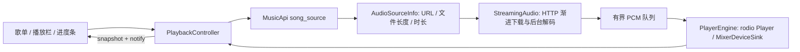

# 项目结构与播放链路

## 运行和验证

应用通过 `COOKIE` 环境变量读取登录凭据，不自行读取 `.env`。
开发时可使用 `dotenv run cargo run`。`cargo check`、`cargo test` 不启动界面；真实接口验证使用 `dotenv run cargo test -- --include-ignored`。

## 模块职责

```text
src/
├── main.rs                  初始化服务、创建 Entity、打开窗口
├── api.rs                   网易云接口及共享网络客户端、Tokio 运行时
├── models/                  歌曲、歌单、用户资料、播放资源信息
├── state/                   账号、音乐库索引、当前浏览的歌单详情
├── playback/
│   ├── mod.rs               对外类型与只读 PlaybackSnapshot
│   ├── controller.rs        GPUI Entity：控制入口、队列、请求、通知
│   ├── engine.rs            rodio 设备、当前播放源、暂停、音量
│   └── stream.rs            HTTP 下载、渐进缓存、后台解码、PCM 队列
└── ui/
    ├── shell.rs             主窗口布局、导航协调、页面生命周期
    ├── sidebar.rs           侧栏 View 与导航事件
    ├── pages/               页面 View
    ├── components/          播放栏、进度条、标签栏、虚拟表格
    ├── assets.rs            静态资源及远程缩略图 URL
    └── theme.rs             字体、主题与 UI 样式常量
```

`models` 是数据类型，不依赖 GPUI。登录资料与歌单创建者都使用 `UserProfile`，但只有 `AccountState` 负责加载登录账号与会员资料，歌单创建者不会携带账号加载逻辑。

GPUI 的共享业务对象放在 Entity 中：`AccountState`、`MusicLibrary`、`PlaylistDetail`、`PlaybackController`。View 观察 Entity 的通知并渲染；底层 `PlayerEngine` 和流式解码实现不依赖 GPUI 或网易云 SDK。

## 统一播放入口

界面只持有 `Entity<PlaybackController>`，用 `snapshot()` 读取状态，所有修改通过控制器方法提交。

| 接口 | 用途 |
| --- | --- |
| `play_from_queue(songs, song_id, cx)` | 按给定队列选歌；继续当前未播完的歌曲时保留进度。 |
| `pause(cx)` / `resume(cx)` / `toggle(cx)` | 控制当前播放；加载期间保留用户的播放意图。 |
| `previous(cx)` / `next(cx)` | 按队列顺序切歌，队列边界不循环。 |
| `seek_to(Duration, cx)` | 提交时间位置，由后台解码线程完成跳转。 |
| `set_volume(f32, cx)` | 0..=1，超出范围钳制，忽略非有限值；切歌与重试保留音量。 |
| `snapshot()` | 只读当前歌曲、位置、时长、播放/加载状态、错误和音量。 |
| `progress()` / `can_seek()` / `is_play_requested()` | 给现有播放控件提供显示与交互依据。 |

使用示例：

```rust,ignore
playback.update(cx, |controller, cx| {
    controller.pause(cx);
    controller.seek_to(std::time::Duration::from_secs(125), cx);
    controller.set_volume(0.5, cx);
});
```

歌曲 ID 使用 `u64`，时间使用 `Duration`。进度条在释放时将百分比换算为时间，控制器不依赖 Slider 类型。控制器保存私有快照，不提供可变借用，避免 UI 修改状态但未同步到音频引擎。

## 播放地址与流式音频



`MusicApi::song_source` 使用现有 COOKIE 调用 `song_url_v1`，返回 standard 音质的 `AudioSourceInfo`。音频服务器连接、状态检查、下载超时和读取放在播放模块。音频直接使用 reqwest，GPUI 图片使用 reqwest-client；后者内部依赖 gpui-pre-reqwest 分支，两种客户端各自复用连接池，共用 Tokio 运行时，不向资源服务器发送账号 COOKIE。

HTTP 响应边下载边写入内存缓存。后台解码线程通过 `Read + Seek` 读取缓存，缺数据时在该线程等待。解码结果进入约 400 ms 的有界 PCM 队列；输出线程只取已准备好的样本，缺数据时输出完整声道帧的静音，不等待网络。

引擎长期保留 MixerDeviceSink，换歌时创建新的 Player，释放旧播放源并取消旧下载。控制器每 250 ms 读取已交给输出链路的歌曲样本位置，缓冲静音不计入进度；这不是声卡实际输出时间的精确测量。正常 EOF 后自动播放下一首，队列末尾停止；下载或解码失败则停止并记录错误，点击播放可重试。请求代次防止过期加载结果覆盖新歌曲。

Seek 清空旧 PCM 并立即提交目标。已缓存部分可回退，尚未下载的位置等待顺序下载；UI 线程不等待。时长优先取解码器，其次取播放地址接口（包含试听片段），最后取歌曲详情。歌手文字始终保留，不显示加载或缓冲文字。

单首内存缓存上限 100 MiB，暂不持久化，不发起 HTTP Range 请求。部分索引在尾部的格式仍可能等待尾部数据；即时远端 Seek 和重复播放缓存应在 `stream` 模块扩展。当前没有音量调整 UI，但接口已经作用于引擎并保留设置。

## 歌单与账号状态

账号资料返回后立即通知音乐库，会员资料独立补充。音乐库并行加载歌单索引和喜欢状态；打开歌单才加载详情与歌曲。所有 trackIds 每 200 首请求一次，按原始顺序整理歌曲，缺失的歌曲不伪造。

“我喜欢的音乐”从音乐库中解析 specialType == 5 的歌单 ID，普通歌单使用 ContentPage::Playlist(id)，都进入同一个 PlaylistPage 和 PlaylistDetail。导航只由 shell 协调，页面的显示顺序、标签、列宽和 hover 留在 View。切换歌单取消旧请求并清空旧歌曲，请求代次阻止 A → B → A 的过期结果生效。

选歌时将当前显示顺序复制为播放队列，因此播放与当前浏览的歌单相互独立。离开页面不会停止音乐。歌单标题、封面、创建者和计数取当前歌单；账号头像和会员标识取 AccountState。

## 依赖版本

本轮使用 rodio 0.22.2、reqwest 0.13.5，并更新 Cargo.lock 中兼容的依赖和 gpui-kit Git 版本。rodio 只开启播放和常用格式解码，不开启录音功能。GPUI 与其 reqwest 适配器保持一致的 0.3.7，这是当前发布的 gpui-pre 最新版本。

SDK 内部依赖的 reqwest 0.12、GPUI 分支依赖等由各自上游决定，本项目的音频下载使用 0.13；不能只修改锁文件就把这些类型替换成同一个版本。
